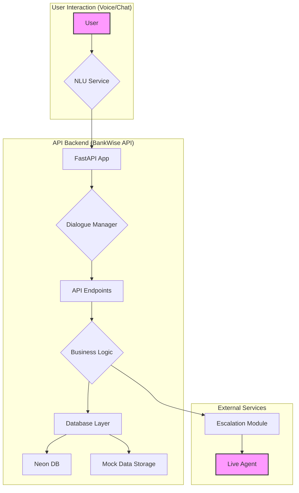

# BankWise API

A comprehensive FastAPI backend for the Inya.ai Inbound Banking Support Agent by **AetherOps** (Team of Mohana Krishna - codexmohan@gmail.com, University ID: 23BAI10630). This API provides mock banking services for handling various customer service scenarios including account balance inquiries, transaction history, card blocking, dispute management, complaint handling, branch/ATM location, KYC status, cheque status, fixed deposit rates, and loan status.

## AI Agent System Prompt

A key component of this project is the sophisticated system prompt designed for the Inya.ai agent. This prompt defines the agent's persona, rules, and dynamic behavior, ensuring a human-like and secure interaction.

**[You can find the full system prompt here: SYSTEM_PROMPT.md](SYSTEM_PROMPT.md)**

## Architecture Diagram



## Features

- **10 Banking Scenarios**: Complete coverage of all required banking use cases
- **Rich Mock Data**: Comprehensive mock datasets with realistic banking data
- **Neon DB Integration**: Persistent data storage with fallback to mock data
- **FastAPI Backend**: Modern, async API with automatic documentation
- **Error Handling**: Robust error handling and fallback mechanisms
- **Logging**: Structured logging for debugging and monitoring
- **Human Escalation**: Support for escalating to human agents
- **Render Ready**: Deployment configuration for Render.com (Free tier compatible)
- **RESTful Design**: Clean, intuitive API endpoints

## Supported Scenarios

1. **Account Balance**: Check account balance information
2. **Transaction History**: View recent transaction history
3. **Card Blocking**: Block credit/debit cards
4. **Dispute Management**: Raise transaction disputes
5. **Complaint Handling**: Create and track complaints
6. **Branch Locator**: Find bank branches by city
7. **ATM Locator**: Find ATMs by pincode
8. **KYC Status**: Check Know Your Customer status
9. **Cheque Status**: Track cheque clearance status
10. **FD Rates**: Get fixed deposit interest rates
11. **Loan Status**: Check loan details and EMI information
12. **Human Escalation**: Escalate to human agent support

## API Endpoints

### Account Services

- `POST /api/account/balance` - Get account balance
- `POST /api/account/transactions` - Get transaction history

### Card Services

- `POST /api/card/block` - Block a card

### Dispute & Complaint Services

- `POST /api/dispute/raise` - Raise a transaction dispute
- `POST /api/complaint/new` - Create a new complaint
- `POST /api/complaint/status` - Check complaint status

### Location Services

- `POST /api/branch/locate` - Locate bank branches
- `POST /api/atm/locate` - Find ATMs

### Status Services

- `POST /api/kyc/status` - Check KYC status
- `POST /api/cheque/status` - Check cheque status
- `POST /api/fd/rates` - Get FD rates
- `POST /api/loan/status` - Check loan status

### Support Services

- `POST /api/escalate` - Escalate to human agent
- `POST /api/chat/intent` - Process natural language intent (NLU placeholder)

### Health Check

- `GET /` - Basic health check
- `GET /health` - Detailed health check

## Quick Start

### Prerequisites

- **Neon DB Account**: Create a free account at [neon.tech](https://neon.tech)
- **Render.com Account**: Create a free account at [render.com](https://render.com)

### Local Development

1. **Install Dependencies**

```bash
pip install -r requirements.txt
```

2. **Set up Environment Variables**

```bash
# Create a .env file
cp .env.example .env
# Edit .env with your Neon DB connection string
```

3. **Run the API**

```bash
uvicorn main:app --host 0.0.0.0 --port 8000 --reload
```

4. **Access API Documentation**

- Swagger UI: `http://localhost:8000/docs`
- ReDoc: `http://localhost:8000/redoc`

### Deployment on Render.com

1. **Set up Neon DB**

   - Create a new project in Neon
   - Get the database connection string
   - Note the database name (default: `neondb`)

2. **Configure Render Environment Variables**

   - Add `DATABASE_URL` with your Neon connection string
   - Add `ENVIRONMENT=production`

3. **Push your code to a Git repository**
4. **Connect your repository to Render.com**
5. **Render will automatically detect the `render.yaml` configuration**
6. **The API will be deployed and available at your Render URL**

### Database Initialization

The application will automatically:

- **First Run**: Create tables and populate with mock data from Faker
- **Subsequent Runs**: Use existing data from Neon DB
- **Fallback**: If Neon DB is unavailable, use mock data as fallback

## API Usage Examples

### Get Account Balance

```bash
curl -X POST "http://localhost:8000/api/account/balance" \
     -H "Content-Type: application/json" \
     -d '{
       "account_number": "123456789012"
     }'
```

**Response:**

```json
{
  "account_number": "******9012",
  "balance": 15430.55,
  "currency": "INR",
  "as_of": "2025-09-21T09:00:00+05:30",
  "status": "success"
}
```

### Get Transaction History

```bash
curl -X POST "http://localhost:8000/api/account/transactions" \
     -H "Content-Type: application/json" \
     -d '{
       "account_number": "123456789012",
       "limit": 5
     }'
```

**Response:**

```json
{
  "account_number": "******9012",
  "transactions": [
    {
      "id": "TXN1234567",
      "date": "2025-09-20T10:30:00+05:30",
      "description": "Purchase at Amazon",
      "amount": 1250.0,
      "type": "PURCHASE",
      "balance_after": 14180.55
    }
  ],
  "total_count": 5,
  "status": "success"
}
```

### Block a Card

```bash
curl -X POST "http://localhost:8000/api/card/block" \
     -H "Content-Type: application/json" \
     -d '{
       "last4": "9012",
       "reason": "Lost card"
     }'
```

**Response:**

```json
{
  "card_number": "****9012",
  "status": "BLOCKED",
  "blocked_at": "2025-09-21T09:00:00+05:30",
  "ticket_id": "BLOCK12345",
  "status": "success"
}
```

### Locate Branches

```bash
curl -X POST "http://localhost:8000/api/branch/locate" \
     -H "Content-Type: application/json" \
     -d '{
       "branch_city": "Mumbai",
       "limit": 3
     }'
```

**Response:**

```json
{
  "branches": [
    {
      "name": "BOB Mumbai Main",
      "address": "123, MG Road",
      "city": "Mumbai",
      "pincode": "400001",
      "ifsc": "BARB0MUMBAI",
      "latitude": 19.076,
      "longitude": 72.8777,
      "distance": 2.5
    }
  ],
  "total_count": 3,
  "status": "success"
}
```

### Escalate to Agent

```bash
curl -X POST "http://localhost:8000/api/escalate" \
     -H "Content-Type: application/json" \
     -d '{
       "reason": "Complex transaction issue",
       "urgency": "high"
     }'
```

**Response:**

```json
{
  "escalation_id": "ESCALATION12345",
  "agent_id": "AGENT789",
  "estimated_wait_time": 15,
  "status": "success"
}
```

## Data Models

### Account Information

```json
{
  "account_number": "123456789012",
  "account_type": "Savings",
  "balance": 15430.55,
  "currency": "INR",
  "customer_name": "John Doe",
  "kyc_status": "VERIFIED",
  "account_status": "ACTIVE"
}
```

### Transaction

```json
{
  "id": "TXN1234567",
  "date": "2025-09-20T10:30:00+05:30",
  "description": "Purchase at Amazon",
  "amount": 1250.0,
  "type": "PURCHASE",
  "balance_after": 14180.55,
  "status": "COMPLETED"
}
```

### Branch

```json
{
  "name": "BOB Mumbai Main",
  "address": "123, MG Road",
  "city": "Mumbai",
  "pincode": "400001",
  "ifsc": "BARB0MUMBAI",
  "latitude": 19.076,
  "longitude": 72.8777,
  "distance": 2.5
}
```

## Error Handling

The API uses standard HTTP status codes and provides detailed error responses:

- **200**: Success
- **400**: Bad Request (invalid input)
- **404**: Not Found (resource not found)
- **500**: Internal Server Error

**Error Response Format:**

```json
{
  "error": "Error message",
  "code": "ERROR_CODE",
  "details": {
    "field": "Additional details"
  }
}
```

## Logging

The API implements structured logging with the following information:

- Request timestamps
- API endpoints and methods
- Response status codes
- Error details
- Performance metrics

Logs are written to both console and `banking_api.log` file.

## Configuration

### Environment Variables

- `PYTHON_VERSION`: Python version (default: "3.11")
- `PORT`: Port number (default: "10000")
- `ENVIRONMENT`: Environment (default: "production")
- `LOG_LEVEL`: Logging level (default: "INFO")

### Mock Data

The API uses comprehensive mock datasets including:

- 100 mock accounts with various types and balances
- 200+ mock cards with different statuses
- 10,000+ mock transactions
- 50+ bank branches across major cities
- 200+ ATMs across different locations
- 200+ complaints with various statuses
- 100+ disputes with tracking
- 150+ loans with different types
- FD rates for various tenures

## Testing

### Manual Testing

Use the provided curl examples or the Swagger UI at `/docs` to test individual endpoints.

### Automated Testing

The API is designed to be easily testable with standard HTTP testing libraries.

## Security Considerations

- All sensitive data (account numbers, card numbers) is masked in responses
- Input validation is implemented for all endpoints
- Error messages do not expose sensitive information
- Mock data contains no real PII

## Contributing

1. Fork the repository
2. Create a feature branch
3. Make your changes
4. Test thoroughly
5. Submit a pull request

## License

This project is for educational and demonstration purposes only.

## Support

For issues and questions, please refer to the project documentation or create an issue in the repository.

---

## Data Sources and Schemas

### Data Sources

- **Mock Data**: All data used in this project is synthetically generated using the **Faker** library. No real customer data is used, in compliance with the hackathon's data policy.
- **Branch & ATM Data**: While mock data is used, this information can be sourced from public bank websites and open government data portals.

### Data Schemas

The API uses Pydantic models to define clear data schemas for all requests and responses. Below are some key examples:

#### Account Balance Request
```json
{
  "account_number": "123456789012"
}
```

#### Account Balance Response
```json
{
  "account_number": "******9012",
  "balance": 15430.55,
  "currency": "INR",
  "as_of": "2025-09-21T09:00:00+05:30",
  "status": "success"
}
```

#### Branch Locator Request
```json
{
  "branch_city": "Mumbai",
  "limit": 3
}
```

#### Branch Record
```json
{
  "name": "BOB Mumbai Main",
  "address": "123, MG Road",
  "city": "Mumbai",
  "pincode": "400001",
  "ifsc": "BARB0MUMBAI",
  "latitude": 19.076,
  "longitude": 72.8777,
  "distance": 2.5
}
```

**Note**: This is a mock API for demonstration purposes. Do not use in production environments with real customer data.
