# 🏦 BankWise API 🚀

<p align="center">
  <!-- Add your logo here if you have one! -->
  <!--  -->
</p>

<p align="center">
  <em>A comprehensive FastAPI backend for the Inya.ai Inbound Banking Support Agent.</em>
  <br>
  <strong>Created by AetherOps (Mohana Krishna - 23BAI10630)</strong>
</p>

<p align="center">
    
    
    
    <a href="https://bankwise-api.onrender.com">
        
    </a>
    
</p>

---

> **Note**: This is a mock API created for the Inya.ai Hackathon. It is intended for educational and demonstration purposes only and should not be used in a production environment with real customer data.

## ✨ Features

-   **🤖 12+ Banking Scenarios**: Complete coverage of all required banking use cases.
-   **📊 Rich Mock Data**: Comprehensive mock datasets with realistic banking data.
-   **🐘 Neon DB Integration**: Persistent data storage with fallback to mock data.
-   **🚀 FastAPI Backend**: Modern, async API with automatic interactive documentation.
-   **🛡️ Robust Error Handling**: Graceful error handling and fallback mechanisms.
-   **📝 Structured Logging**: Detailed logging for easy debugging and monitoring.
-   **🧑‍💼 Human Escalation**: Seamless support for escalating to live agents.
-   **☁️ Render Ready**: Pre-configured for easy deployment on Render.com (Free tier compatible).
-   **🎨 RESTful Design**: Clean, intuitive, and well-structured API endpoints.

## 🏛️ Architecture

```mermaid
graph TD
    subgraph "User Interaction (Voice/Chat)"
        A[👤 User] --> B{🤖 NLU Service};
    end

    subgraph "API Backend (BankWise API)"
        B --> C[🚀 FastAPI App];
        C --> D{🧠 Dialogue Manager};
        D --> E[Endpoints];
        E --> F{⚙️ Business Logic};
        F --> G[🗃️ Database Layer];
        G --> H[🐘 Neon DB];
        G --> I[📦 Mock Data Storage];
    end

    subgraph "External Services"
        F --> J[🧑‍💼 Escalation Module];
        J --> K[📞 Live Agent];
    end

    style A fill:#cde4ff,stroke:#333,stroke-width:2px;
    style K fill:#cde4ff,stroke:#333,stroke-width:2px;
```



## 🚀 Quick Start

### Prerequisites

-   **Neon DB Account**: Create a free account at [neon.tech](https://neon.tech)
-   **Render.com Account**: Create a free account at [render.com](https://render.com)

### 💻 Local Development

1.  **Clone the repository**
    ```bash
    git clone https://github.com/your-username/BankWise.git
    cd BankWise
    ```

2.  **Install Dependencies**
    ```bash
    pip install -r requirements.txt
    ```

3.  **Set up Environment Variables**
    ```bash
    # Create a .env file from the example
    cp .env.example .env
    # Edit .env with your Neon DB connection string
    ```

4.  **Run the API**
    ```bash
    uvicorn main:app --host 0.0.0.0 --port 8000 --reload
    ```

5.  **Access API Documentation**
    -   **Swagger UI**: [`http://localhost:8000/docs`](http://localhost:8000/docs) 📚
    -   **ReDoc**: [`http://localhost:8000/redoc`](http://localhost:8000/redoc) 📖

### ☁️ Deployment on Render.com

1.  **Push your code to a Git repository** (GitHub, GitLab, etc.).
2.  **Create a new "Web Service" on Render.com** and connect your repository.
3.  **Configure Environment Variables** in the Render dashboard:
    -   `DATABASE_URL`: Your Neon DB connection string.
    -   `ENVIRONMENT`: `production`
4.  **Render will automatically detect the `render.yaml` configuration and deploy the API.**
5.  Your API will be live at the URL provided by Render! 🌐

## 🛠️ API Endpoints & Examples

For comprehensive usage examples, please see the **[API Examples documentation](API_EXAMPLES.md)**.

<details>
<summary><strong>Click to expand API Endpoints Summary</strong></summary>

### 👤 Account Services
- `POST /api/account/balance` - Get account balance
- `POST /api/account/transactions` - Get transaction history

### 💳 Card Services
- `POST /api/card/block` - Block a card

### 🗣️ Dispute & Complaint Services
- `POST /api/dispute/raise` - Raise a transaction dispute
- `POST /api/complaint/new` - Create a new complaint
- `POST /api/complaint/status` - Check complaint status

### 📍 Location Services
- `POST /api/branch/locate` - Locate bank branches
- `POST /api/atm/locate` - Find ATMs

### 📝 Status Services
- `POST /api/kyc/status` - Check KYC status
- `POST /api/cheque/status` - Check cheque status
- `POST /api/fd/rates` - Get FD rates
- `POST /api/loan/status` - Check loan status

### 🧑‍💼 Support Services
- `POST /api/escalate` - Escalate to human agent
- `POST /api/chat/intent` - Process natural language intent (NLU placeholder)

### ❤️ Health Check
- `GET /` - Basic health check
- `GET /health` - Detailed health check

</details>

## 🔒 Security Considerations

-   **Data Masking**: All sensitive data (account numbers, card numbers) is masked in API responses.
-   **Input Validation**: Rigorous input validation is implemented for all endpoints using Pydantic.
-   **Secure Error Messages**: Error messages are designed to not expose sensitive system information.
-   **No PII**: The mock dataset contains no real Personally Identifiable Information (PII).

## 🤝 Contributing

Contributions are welcome! Please follow these steps:

1.  **Fork** the repository.
2.  Create a new **feature branch**.
3.  Make your changes and **test thoroughly**.
4.  Submit a **pull request**.

## 📜 License

This project is licensed under the MIT License.

---

<p align="center">
  Made with ❤️ by <strong>AetherOps</strong>
</p>
