# 🏦 BankWise API 🚀

<p align="center">
  
  
  
  
  
  
  
  
  
  
</p>

<p align="center">
  <em>A comprehensive FastAPI backend for the Inya.ai Inbound Banking Support Agent.</em>
  <br>
  <strong>Created by AetherOps (Mohana Krishna - 23BAI10630)</strong>
</p>

## 🚀 Tech Stack

<div align="center">
  <table>
    <tr>
      <th>Category</th>
      <th>Technologies</th>
      <th>Key Features</th>
    </tr>
    <tr>
      <td>🌐 Framework</td>
      <td>
        
        
        
      </td>
      <td>Async support, Automatic docs, Data validation</td>
    </tr>
    <tr>
      <td>🗄️ Database</td>
      <td>
        
        
        
      </td>
      <td>Serverless Postgres, Connection pooling, Automatic failover</td>
    </tr>
    <tr>
      <td>🤖 AI Processing</td>
      <td>
        
        
      </td>
      <td>Intent classification, Entity extraction, Persona management</td>
    </tr>
    <tr>
      <td>🛠️ Dev Tools</td>
      <td>
        
        
        
      </td>
      <td>Fast dependency resolution, Consistent formatting, Test coverage</td>
    </tr>
    <tr>
      <td>📱 Services</td>
      <td>
        
        
      </td>
      <td>Global SMS delivery, Serverless deployment, Zero-downtime updates</td>
    </tr>
  </table>
</div>

---

> **Note**: This is a mock API created for the Inya.ai Hackathon. It is intended for educational and demonstration purposes only and should not be used in a production environment with real customer data.

## ✨ Enhanced Features

-   **🤖 15+ Banking Scenarios**: Complete coverage of account, card, loan, FD and dispute management
-   **🧠 AI-Powered Processing**: NLU intent classification and persona-based response generation
-   **⚙️ Multi-Layer Architecture**: Clear separation of concerns across interface, application, business and data layers
-   **📊 Dual Data Sources**: Neon PostgreSQL with automatic fallback to JSON mock data
-   **🎭 Adaptive Responses**: Emotion-aware responses with Default, Empathetic, and Efficient personas
-   **🛡️ Enterprise Security**: PII masking, input validation, and audit trails
-   **🚀 FastAPI Backend**: Async API with auto-generated OpenAPI documentation
-   **📈 Comprehensive Monitoring**: Performance metrics and structured logging
-   **☁️ Render Ready**: Pre-configured for seamless deployment
-   **🎨 Dashboard**: Sophisticated web interface for viewing mock data in interactive tables

## 🤖 AI Agent (Aria)

BankWise features Aria, our intelligent banking assistant that provides:
- **Persona-Based Interactions**: Adapts tone based on user emotion (Default, Empathetic, Efficient)
- **Context-Aware Conversations**: Maintains session context across multiple interactions
- **Smart Escalation**: Seamless handoff to human agents when needed
- **Proactive Assistance**: Anticipates user needs with relevant suggestions

## 🏛️ Architecture Overview

```mermaid
graph TD
    subgraph "🌐 External Interfaces"
        A[👤 User Voice/Chat] --> B[🤖 Inya.ai Platform]
        B --> C[🔌 API Gateway]
    end

    subgraph "🚀 FastAPI Application Layer"
        C --> D[🛡️ Authentication Layer]
        D --> E[📋 Request Validation]
        E --> F[🧠 Route Handler]
        
        subgraph "📍 API Endpoints"
            F --> G1[👤 Account Services]
            F --> G2[💳 Card Services]
            F --> G3[🏦 Branch/ATM Locator]
            F --> G4[📝 Complaint/Dispute]
            F --> G5[💰 Loan/FD Services]
            F --> G6[📄 Document Services]
            F --> G7[🆘 Escalation Service]
            F --> G8[💬 Chat/Intent Processing]
            F --> G9[🎨 Dashboard]
        end
    end

    subgraph "🔧 Business Logic Layer"
        G1 --> H[⚙️ Service Controllers]
        G2 --> H
        G3 --> H
        G4 --> H
        G5 --> H
        G6 --> H
        G7 --> H
        G8 --> H
        
        H --> I[🔍 Data Validation]
        I --> J[🎭 Response Masking]
    end

    subgraph "💾 Data Access Layer"
        J --> K{🗄️ Data Source Router}
        K -->|Primary| L[🐘 Neon PostgreSQL]
        K -->|Fallback| M[📦 Mock Data Storage]
        
        subgraph "📊 Mock Data System"
            M --> N[📁 JSON Files]
            N --> N1[accounts.json]
            N --> N2[cards.json]
            N --> N3[transactions.json]
            N --> N4[branches.json]
            N --> N5[complaints.json]
            N --> N6[disputes.json]
            N --> N7[loans.json]
            N --> N8[fd_rates.json]
            N --> N9[atms.json]
            N --> N10[cheques.json]
        end
    end

    subgraph "🔄 External Services"
        J --> O[📱 SMS Service]
        G7 --> P[🧑‍💼 Human Agent System]
        J --> Q[📍 Location Services]
    end

    subgraph "📊 Monitoring & Logging"
        H --> R[📈 Structured Logging]
        R --> S[📋 banking_api.log]
        H --> T[⚡ Performance Metrics]
    end

    %% Styling with professional colors
    classDef userInterface fill:#e1f5fe,stroke:#01579b,stroke-width:3px,color:#000
    classDef apiLayer fill:#f3e5f5,stroke:#4a148c,stroke-width:2px,color:#000
    classDef businessLayer fill:#e8f5e8,stroke:#1b5e20,stroke-width:2px,color:#000
    classDef dataLayer fill:#fff3e0,stroke:#e65100,stroke-width:2px,color:#000
    classDef externalServices fill:#fce4ec,stroke:#880e4f,stroke-width:2px,color:#000
    classDef monitoring fill:#f1f8e9,stroke:#33691e,stroke-width:2px,color:#000

    class A,B,C userInterface
    class D,E,F,G1,G2,G3,G4,G5,G6,G7,G8,G9 apiLayer
    class H,I,J businessLayer
    class K,L,M,N,N1,N2,N3,N4,N5,N6,N7,N8,N9,N10 dataLayer
    class O,P,Q externalServices
    class R,S,T monitoring
```



### 🤖 AI Agent Logic Flow (Aria)

```mermaid
graph TD
    subgraph "🎯 User Input Processing"
        A[👤 User Input] --> B[🧠 NLU Processing]
        B --> C{🎭 Persona State Detection}
        C -->|Calm/Normal| D1[😌 Default State]
        C -->|Stress/Frustration| D2[🤗 Empathetic State]
        C -->|Direct/Efficient| D3[⚡ Efficient State]
    end

    subgraph "🔍 Decision-Making Framework"
        D1 --> E[📋 Step 1: Understand Goal]
        D2 --> E
        D3 --> E
        
        E --> F{🎯 Goal Clarity Check}
        F -->|Clear| G[📊 Step 2: Intent Classification]
        F -->|Unclear| H[❓ Clarification Request]
        H --> A
        
        G --> I{🔄 Query Type Analysis}
        I -->|General Info| J[ℹ️ General Information Query]
        I -->|Specific Action| K[⚙️ Specific Action Query]
    end

    subgraph "ℹ️ General Information Flow"
        J --> L{🎌 Bank Context Check}
        L --> M[📚 Knowledge Base Query]
        M --> N[📤 Direct Response]
        N --> Z[📋 Response Delivery]
    end

    subgraph "⚙️ Specific Action Flow"
        K --> O[🔍 Entity Extraction]
        O --> P{📊 Required Entities Check}
        P -->|Missing| Q[❓ Entity Collection]
        P -->|Complete| R[🛠️ Action Selection]
        Q --> A
        
        R --> S{🛡️ Security Validation}
        S -->|High Risk| T[⚠️ Confirmation Request]
        S -->|Safe| U[🎯 Action Execution]
        T --> U
    end

    subgraph "🎯 Action Execution Engine"
        U --> V{🔧 Action Type Router}
        
        V -->|Account| W1[AccountBalanceAction]
        V -->|Transaction| W2[GetTransactionHistoryAction]
        V -->|Card| W3[BlockCard]
        V -->|Dispute| W4[RaiseTransactionDisputeAction]
        V -->|Complaint| W5[NewComplaintAction / ComplaintStatusAction]
        V -->|Location| W6[LocateBranchAction / LocateATMAction]
        V -->|KYC| W7[CheckKYCStatusAction]
        V -->|Cheque| W8[CheckChequeStatusAction]
        V -->|FD| W9[GetAllFDRatesAction / GetFDRatesByTenureAction]
        V -->|Loan| W10[GetLoanStatusAction]
        V -->|Escalate| W11[escalate_to_agent]
        
        W1 --> X[🔄 API Call Processing]
        W2 --> X
        W3 --> X
        W4 --> X
        W5 --> X
        W6 --> X
        W7 --> X
        W8 --> X
        W9 --> X
        W10 --> X
        W11 --> AA[🧑‍💼 Human Handoff]
    end

    subgraph "🔄 Error Handling & Recovery"
        X --> Y{✅ Success Check}
        Y -->|Success| Z
        Y -->|First Failure| Y1[🔄 Silent Retry]
        Y1 --> Y2{✅ Retry Success Check}
        Y2 -->|Success| Z
        Y2 -->|Second Failure| Y3[⚠️ Escalation Trigger]
        Y3 --> W11
    end

    subgraph "📋 Response Generation"
        Z --> Z1[🎭 Persona-Aware Response]
        Z1 --> Z2[🛡️ Data Masking]
        Z2 --> Z3[🌍 Language Adaptation]
        Z3 --> Z4[📊 Context Preservation]
        Z4 --> Z5[🎯 Proactive Suggestions]
        Z5 --> BB[📤 Final Response]
    end

    subgraph "🚨 Escalation Triggers"
        BB --> CC{🚨 Escalation Check}
        CC -->|Direct Request| W11
        CC -->|High Risk| W11
        CC -->|Strong Frustration| W11
        CC -->|Repeated Failures| W11
        CC -->|Out of Scope| W11
        CC -->|Continue| DD[📈 Session Update]
    end

    subgraph "📊 Session Management"
        DD --> EE[💾 Context Storage]
        EE --> FF[📈 Intent History]
        FF --> GG[🔄 Conversation Loop]
        GG --> A
    end

    %% Professional color scheme
    classDef input fill:#e3f2fd,stroke:#0277bd,stroke-width:2px,color:#000
    classDef decision fill:#f3e5f5,stroke:#7b1fa2,stroke-width:2px,color:#000
    classDef process fill:#e8f5e8,stroke:#388e3c,stroke-width:2px,color:#000
    classDef action fill:#fff3e0,stroke:#f57c00,stroke-width:2px,color:#000
    classDef response fill:#fce4ec,stroke:#c2185b,stroke-width:2px,color:#000
    classDef error fill:#ffebee,stroke:#d32f2f,stroke-width:2px,color:#000
    classDef escalation fill:#f1f8e9,stroke:#689f38,stroke-width:2px,color:#000

    class A,B input
    class C,F,I,L,P,S,V,Y,Y2,CC decision
    class E,G,J,K,O,R,Z1,Z2,Z3,Z4,Z5,DD,EE,FF process
    class W1,W2,W3,W4,W5,W6,W7,W8,W9,W10,X action
    class N,Z,BB response
    class Y1,Y3 error
    class W11,AA escalation

    %% State styling
    classDef stateDefault fill:#e1f5fe,stroke:#01579b,stroke-width:2px,color:#000
    classDef stateEmpathetic fill:#f9fbe7,stroke:#827717,stroke-width:2px,color:#000
    classDef stateEfficient fill:#e0f2f1,stroke:#00695c,stroke-width:2px,color:#000

    class D1 stateDefault
    class D2 stateEmpathetic
    class D3 stateEfficient
```


## 🏛️ Architecture Components

### 🌐 External Interfaces
- **User Voice/Chat**: Multi-channel input (voice and text)
- **Inya.ai Platform**: AI conversation management platform
- **API Gateway**: Entry point with load balancing and security

### 🚀 FastAPI Application Layer
- **Authentication Layer**: API token validation
- **Request Validation**: Pydantic models for input validation
-   **Route Handlers**: 13+ specialized endpoints covering all banking scenarios and judge dashboard

### 🔧 Business Logic Layer
- **Service Controllers**: Business logic implementation
- **Data Validation**: Foreign key validation and data integrity
- **Response Masking**: PII protection and data security

### 💾 Data Access Layer
- **Primary**: Neon PostgreSQL database with full CRUD operations
- **Fallback**: Mock data system with 10 JSON data files
- **Smart Routing**: Automatic fallback on database failures

### 🔄 External Services
- **SMS Service**: Twilio integration for notifications
- **Human Agent System**: Escalation handling
- **Location Services**: Branch and ATM finder

### 📊 Monitoring & Logging
- **Structured Logging**: Comprehensive request/response logging
- **Performance Metrics**: Response time and error tracking
- **Health Monitoring**: Database and service health checks

### 🤖 AI Agent Components
- **🎭 Persona States**: Adaptive responses based on user emotion
- **🧠 Decision Framework**: Goal understanding and intent classification
- **⚙️ Action Execution**: 12 core banking operations with error recovery
- **🚨 Escalation System**: Context-preserving handoff to human agents
- **📊 Session Management**: Multi-turn conversation memory

## 🚀 Quick Start

### Prerequisites

-   **Neon DB Account**: Create a free account at [neon.tech](https://neon.tech)
-   **Render.com Account**: Create a free account at [render.com](https://render.com)

### 💻 Local Development

1.  **Clone the repository**
    ```bash
    git clone https://github.com/your-username/BankWise.git
    cd BankWise
    ```

2.  **Install Dependencies**
    ```bash
    pip install -r requirements.txt
    ```

3.  **Set up Environment Variables**
    ```bash
    # Create a .env file from the example
    cp .env.example .env
    # Edit .env with your Neon DB connection string
    ```

4.  **Run the API**
    ```bash
    uvicorn main:app --host 0.0.0.0 --port 8000 --reload
    ```

5.  **Access API Documentation**
    -   **Swagger UI**: [`http://localhost:8000/docs`](http://localhost:8000/docs) 📚
    -   **ReDoc**: [`http://localhost:8000/redoc`](http://localhost:8000/redoc) 📖

### ☁️ Deployment on Render.com

1.  **Push your code to a Git repository** (GitHub, GitLab, etc.).
2.  **Create a new "Web Service" on Render.com** and connect your repository.
3.  **Configure Environment Variables** in the Render dashboard:
    -   `DATABASE_URL`: Your Neon DB connection string.
    -   `ENVIRONMENT`: `production`
4.  **Render will automatically detect the `render.yaml` configuration and deploy the API.**
5.  Your API will be live at the URL provided by Render! 🌐

## 🛠️ API Endpoints Quick Reference

<div align="center">
  <table>
    <tr>
      <th>Service Category</th>
      <th>Endpoint</th>
      <th>Method</th>
      <th>Description</th>
    </tr>
    <tr>
      <td rowspan="2">👤 Account</td>
      <td><code>/api/account/balance</code></td>
      <td>POST</td>
      <td>Get account balance</td>
    </tr>
    <tr>
      <td><code>/api/account/transactions</code></td>
      <td>POST</td>
      <td>Get transaction history</td>
    </tr>
    <tr>
      <td>💳 Card</td>
      <td><code>/api/card/block</code></td>
      <td>POST</td>
      <td>Block a card</td>
    </tr>
    <tr>
      <td rowspan="3">📝 Dispute & Complaint</td>
      <td><code>/api/dispute/raise</code></td>
      <td>POST</td>
      <td>Raise transaction dispute</td>
    </tr>
    <tr>
      <td><code>/api/complaint/new</code></td>
      <td>POST</td>
      <td>Create new complaint</td>
    </tr>
    <tr>
      <td><code>/api/complaint/status</code></td>
      <td>POST</td>
      <td>Check complaint status</td>
    </tr>
    <tr>
      <td rowspan="2">📍 Location</td>
      <td><code>/api/branch/locate</code></td>
      <td>POST</td>
      <td>Locate bank branches</td>
    </tr>
    <tr>
      <td><code>/api/atm/locate</code></td>
      <td>POST</td>
      <td>Find ATMs</td>
    </tr>
    <tr>
      <td rowspan="4">📝 Status</td>
      <td><code>/api/kyc/status</code></td>
      <td>POST</td>
      <td>Check KYC status</td>
    </tr>
    <tr>
      <td><code>/api/cheque/status</code></td>
      <td>POST</td>
      <td>Check cheque status</td>
    </tr>
    <tr>
      <td><code>/api/fd/rates</code></td>
      <td>POST</td>
      <td>Get FD rates</td>
    </tr>
    <tr>
      <td><code>/api/loan/status</code></td>
      <td>POST</td>
      <td>Check loan status</td>
    </tr>
    <tr>
      <td rowspan="2">🧑‍💼 Support</td>
      <td><code>/api/escalate</code></td>
      <td>POST</td>
      <td>Escalate to human agent</td>
    </tr>
    <tr>
      <td><code>/api/chat/intent</code></td>
      <td>POST</td>
      <td>Process natural language intent</td>
    </tr>
    <tr>
      <td rowspan="2">❤️ Health</td>
      <td><code>/</code></td>
      <td>GET</td>
      <td>Basic health check</td>
    </tr>
    <tr>
      <td><code>/health</code></td>
      <td>GET</td>
      <td>Detailed health check</td>
    </tr>
    <tr>
      <td>👨‍⚖️ Judge Dashboard</td>
      <td><code>/dashboard/</code></td>
      <td>GET</td>
      <td>Interactive dashboard for viewing mock data</td>
    </tr>
  </table>
</div>

For comprehensive usage examples, please see the **[API Examples documentation](API_EXAMPLES.md)**.

### 👨‍⚖️ Judge Dashboard

The Judge Dashboard provides a sophisticated web interface for hackathon judges to view mock data:

**Features:**
- **Interactive Data Tables**: Browse all mock data in sortable, searchable tables
- **Dual Data Sources**: Switch between mock data and database views
- **Multiple Data Types**: View accounts, transactions, branches, complaints, and more
- **Real-time Updates**: Auto-refresh every 5 minutes
- **Responsive Design**: Works on desktop and mobile devices
- **GitHub Theme**: Professional dark/light theme support

**Access:**
- **URL**: [`/dashboard/`](/dashboard/)
- **Data Types**: Accounts, Transactions, Branches, ATMs, Complaints, Disputes, Loans, FD Rates, Cards, Cheques
- **Sources**: Mock Data (JSON files) or Database (PostgreSQL)

**Usage:**
1. Navigate to `/dashboard/` in your browser
2. Select a data type from the sidebar
3. Toggle between Mock Data and Database sources
4. View data in table or JSON format
5. Click "View Details" for complex nested objects

## 🔒 Security Considerations

-   **Data Masking**: All sensitive data (account numbers, card numbers) is masked in API responses.
-   **Input Validation**: Rigorous input validation is implemented for all endpoints using Pydantic.
-   **Secure Error Messages**: Error messages are designed to not expose sensitive system information.
-   **No PII**: The mock dataset contains no real Personally Identifiable Information (PII).

## 🤝 Contributing

Contributions are welcome! Please follow these steps:

1.  **Fork** the repository.
2.  Create a new **feature branch**.
3.  Make your changes and **test thoroughly**.
4.  Submit a **pull request**.

## 📜 License

This project is licensed under the MIT License.

---

<p align="center">
  Made with ❤️ by <strong>AetherOps</strong>
</p>
