# BankWise AI Agent (Aria) Logic Flow

```mermaid
graph TD
    subgraph "🎯 User Input Processing"
        A[👤 User Input] --> B[🧠 NLU Processing]
        B --> C{🎭 Persona State Detection}
        C -->|Calm/Normal| D1[😌 Default State]
        C -->|Stress/Frustration| D2[🤗 Empathetic State]
        C -->|Direct/Efficient| D3[⚡ Efficient State]
    end

    subgraph "🔍 Decision-Making Framework"
        D1 --> E[📋 Step 1: Understand Goal]
        D2 --> E
        D3 --> E
        
        E --> F{🎯 Goal Clarity Check}
        F -->|Clear| G[📊 Step 2: Intent Classification]
        F -->|Unclear| H[❓ Clarification Request]
        H --> A
        
        G --> I{🔄 Query Type Analysis}
        I -->|General Info| J[ℹ️ General Information Query]
        I -->|Specific Action| K[⚙️ Specific Action Query]
    end

    subgraph "ℹ️ General Information Flow"
        J --> L{🎌 Bank Context Check}
        L --> M[📚 Knowledge Base Query]
        M --> N[📤 Direct Response]
        N --> Z[📋 Response Delivery]
    end

    subgraph "⚙️ Specific Action Flow"
        K --> O[🔍 Entity Extraction]
        O --> P{📊 Required Entities Check}
        P -->|Missing| Q[❓ Entity Collection]
        P -->|Complete| R[🛠️ Action Selection]
        Q --> A
        
        R --> S{🛡️ Security Validation}
        S -->|High Risk| T[⚠️ Confirmation Request]
        S -->|Safe| U[🎯 Action Execution]
        T --> U
    end

    subgraph "🎯 Action Execution Engine"
        U --> V{🔧 Action Type Router}
        
        V -->|Account| W1[AccountBalanceAction]
        V -->|Transaction| W2[GetTransactionHistoryAction]
        V -->|Card| W3[BlockCard]
        V -->|Dispute| W4[RaiseTransactionDisputeAction]
        V -->|Complaint| W5[NewComplaintAction / ComplaintStatusAction]
        V -->|Location| W6[LocateBranchAction / LocateATMAction]
        V -->|KYC| W7[CheckKYCStatusAction]
        V -->|Cheque| W8[CheckChequeStatusAction]
        V -->|FD| W9[GetAllFDRatesAction / GetFDRatesByTenureAction]
        V -->|Loan| W10[GetLoanStatusAction]
        V -->|Escalate| W11[escalate_to_agent]
        
        W1 --> X[🔄 API Call Processing]
        W2 --> X
        W3 --> X
        W4 --> X
        W5 --> X
        W6 --> X
        W7 --> X
        W8 --> X
        W9 --> X
        W10 --> X
        W11 --> AA[🧑‍💼 Human Handoff]
    end

    subgraph "🔄 Error Handling & Recovery"
        X --> Y{✅ Success Check}
        Y -->|Success| Z
        Y -->|First Failure| Y1[🔄 Silent Retry]
        Y1 --> Y2{✅ Retry Success Check}
        Y2 -->|Success| Z
        Y2 -->|Second Failure| Y3[⚠️ Escalation Trigger]
        Y3 --> W11
    end

    subgraph "📋 Response Generation"
        Z --> Z1[🎭 Persona-Aware Response]
        Z1 --> Z2[🛡️ Data Masking]
        Z2 --> Z3[🌍 Language Adaptation]
        Z3 --> Z4[📊 Context Preservation]
        Z4 --> Z5[🎯 Proactive Suggestions]
        Z5 --> BB[📤 Final Response]
    end

    subgraph "🚨 Escalation Triggers"
        BB --> CC{🚨 Escalation Check}
        CC -->|Direct Request| W11
        CC -->|High Risk| W11
        CC -->|Strong Frustration| W11
        CC -->|Repeated Failures| W11
        CC -->|Out of Scope| W11
        CC -->|Continue| DD[📈 Session Update]
    end

    subgraph "📊 Session Management"
        DD --> EE[💾 Context Storage]
        EE --> FF[📈 Intent History]
        FF --> GG[🔄 Conversation Loop]
        GG --> A
    end

    %% Professional color scheme
    classDef input fill:#e3f2fd,stroke:#0277bd,stroke-width:3px,color:#000
    classDef decision fill:#f3e5f5,stroke:#7b1fa2,stroke-width:2px,color:#000
    classDef process fill:#e8f5e8,stroke:#388e3c,stroke-width:2px,color:#000
    classDef action fill:#fff3e0,stroke:#f57c00,stroke-width:2px,color:#000
    classDef response fill:#fce4ec,stroke:#c2185b,stroke-width:2px,color:#000
    classDef error fill:#ffebee,stroke:#d32f2f,stroke-width:2px,color:#000
    classDef escalation fill:#f1f8e9,stroke:#689f38,stroke-width:2px,color:#000

    class A,B input
    class C,F,I,L,P,S,V,Y,Y2,CC decision
    class E,G,J,K,O,R,Z1,Z2,Z3,Z4,Z5,DD,EE,FF process
    class W1,W2,W3,W4,W5,W6,W7,W8,W9,W10,X action
    class N,Z,BB response
    class Y1,Y3 error
    class W11,AA escalation

    %% State styling
    classDef stateDefault fill:#e1f5fe,stroke:#01579b,stroke-width:2px,color:#000
    classDef stateEmpathetic fill:#f9fbe7,stroke:#827717,stroke-width:2px,color:#000
    classDef stateEfficient fill:#e0f2f1,stroke:#00695c,stroke-width:2px,color:#000

    class D1 stateDefault
    class D2 stateEmpathetic
    class D3 stateEfficient
```

## AI Agent Logic Components

### 🎭 Persona State Management
- **Default State**: Calm, supportive, solution-oriented tone
- **Empathetic State**: Activated by stress/frustration detection
- **Efficient State**: Mirror user's directness for quick resolution

### 🧠 Decision-Making Framework
1. **Goal Understanding**: Clarity assessment and intent detection
2. **Query Classification**: General information vs. specific actions
3. **Entity Management**: Required parameter collection
4. **Security Validation**: Risk assessment for sensitive operations

### 🛠️ Action Execution System
- **12 Core Actions**: Complete coverage of banking scenarios
- **API Integration**: Seamless backend communication
- **Error Recovery**: Silent retry mechanism with escalation fallback

### 🚨 Intelligent Escalation
- **Trigger Conditions**: Direct request, high-risk issues, frustration, failures
- **Context Handoff**: Complete session summary for human agents
- **Graceful Transfer**: Smooth transition without data loss

### 🔄 Conversation Flow
- **Context Preservation**: Multi-turn conversation memory
- **Language Adaptation**: English/Hindi with code-mixing support
- **Proactive Assistance**: Anticipatory next-step suggestions

### 🛡️ Security & Compliance
- **Data Masking**: PII protection in all responses
- **Input Validation**: Comprehensive security checks
- **Audit Trail**: Complete interaction logging