# BankWise API Backend Architecture

```mermaid
graph TD
    subgraph "🌐 External Interfaces"
        A[👤 User Voice/Chat] --> B[🤖 Inya.ai Platform]
        B --> C[🔌 API Gateway]
    end

    subgraph "🚀 FastAPI Application Layer"
        C --> D[🛡️ Authentication Layer]
        D --> E[📋 Request Validation]
        E --> F[🧠 Route Handler]
        
        subgraph "📍 API Endpoints"
            F --> G1[👤 Account Services]
            F --> G2[💳 Card Services]
            F --> G3[🏦 Branch/ATM Locator]
            F --> G4[📝 Complaint/Dispute]
            F --> G5[💰 Loan/FD Services]
            F --> G6[📄 Document Services]
            F --> G7[🆘 Escalation Service]
            F --> G8[💬 Chat/Intent Processing]
            F --> G9[👨‍⚖️ Judge Dashboard]
        end
    end

    subgraph "🔧 Business Logic Layer"
        G1 --> H[⚙️ Service Controllers]
        G2 --> H
        G3 --> H
        G4 --> H
        G5 --> H
        G6 --> H
        G7 --> H
        G8 --> H
        
        H --> I[🔍 Data Validation]
        I --> J[🎭 Response Masking]
    end

    subgraph "💾 Data Access Layer"
        J --> K{🗄️ Data Source Router}
        K -->|Primary| L[🐘 Neon PostgreSQL]
        K -->|Fallback| M[📦 Mock Data Storage]
        
        subgraph "📊 Mock Data System"
            M --> N[📁 JSON Files]
            N --> N1[accounts.json]
            N --> N2[cards.json]
            N --> N3[transactions.json]
            N --> N4[branches.json]
            N --> N5[complaints.json]
            N --> N6[disputes.json]
            N --> N7[loans.json]
            N --> N8[fd_rates.json]
            N --> N9[atms.json]
            N --> N10[cheques.json]
        end
    end

    subgraph "🔄 External Services"
        J --> O[📱 SMS Service]
        G7 --> P[🧑‍💼 Human Agent System]
        J --> Q[📍 Location Services]
    end

    subgraph "📊 Monitoring & Logging"
        H --> R[📈 Structured Logging]
        R --> S[📋 banking_api.log]
        H --> T[⚡ Performance Metrics]
    end

    %% Styling with professional colors
    classDef userInterface fill:#e1f5fe,stroke:#01579b,stroke-width:3px,color:#000
    classDef apiLayer fill:#f3e5f5,stroke:#4a148c,stroke-width:2px,color:#000
    classDef businessLayer fill:#e8f5e8,stroke:#1b5e20,stroke-width:2px,color:#000
    classDef dataLayer fill:#fff3e0,stroke:#e65100,stroke-width:2px,color:#000
    classDef externalServices fill:#fce4ec,stroke:#880e4f,stroke-width:2px,color:#000
    classDef monitoring fill:#f1f8e9,stroke:#33691e,stroke-width:2px,color:#000

    class A,B,C userInterface
    class D,E,F,G1,G2,G3,G4,G5,G6,G7,G8,G9 apiLayer
    class H,I,J businessLayer
    class K,L,M,N,N1,N2,N3,N4,N5,N6,N7,N8,N9,N10 dataLayer
    class O,P,Q externalServices
    class R,S,T monitoring
```

## Architecture Components

### 🌐 External Interfaces
- **User Voice/Chat**: Multi-channel input (voice and text)
- **Inya.ai Platform**: AI conversation management platform
- **API Gateway**: Entry point with load balancing and security

### 🚀 FastAPI Application Layer
- **Authentication Layer**: API token validation
- **Request Validation**: Pydantic models for input validation
- **Route Handlers**: 12+ specialized endpoints covering all banking scenarios

### 🔧 Business Logic Layer
- **Service Controllers**: Business logic implementation
- **Data Validation**: Foreign key validation and data integrity
- **Response Masking**: PII protection and data security

### 💾 Data Access Layer
-   **Primary**: Neon PostgreSQL database with full CRUD operations
-   **Fallback**: Mock data system with 10 JSON data files
-   **Smart Routing**: Automatic fallback on database failures
-   **Web Interface**: Judge dashboard with interactive data visualization

### 🔄 External Services
-   **SMS Service**: Twilio integration for notifications
-   **Human Agent System**: Escalation handling
-   **Location Services**: Branch and ATM finder
-   **Web Templates**: Jinja2-based dashboard interface

### 📊 Monitoring & Logging
-   **Structured Logging**: Comprehensive request/response logging
-   **Performance Metrics**: Response time and error tracking
-   **Health Monitoring**: Database and service health checks

### 🎨 Web Interface

#### 👨‍⚖️ Judge Dashboard
- **Purpose**: Sophisticated web interface for hackathon judges to view mock data
- **Technology**: FastAPI + Jinja2 templates with Bootstrap 5
- **Features**:
  - Interactive data tables with sorting and search
  - Dual data source support (Mock JSON files vs Database)
  - Multiple data type views (Accounts, Transactions, Branches, etc.)
  - Real-time data refresh every 5 minutes
  - Responsive design for desktop and mobile
  - GitHub theme styling with dark/light mode support
  - JSON view for raw data inspection
  - Modal dialogs for detailed record viewing
- **Access**: `/dashboard/` endpoint
- **Data Types**: Accounts, Transactions, Branches, ATMs, Complaints, Disputes, Loans, FD Rates, Cards, Cheques
- **Sources**: Mock Data (JSON files) or Database (PostgreSQL)
- **API**: `/dashboard/api` endpoint for JSON data retrieval